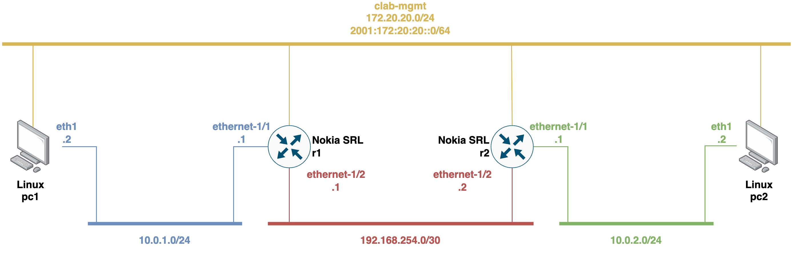
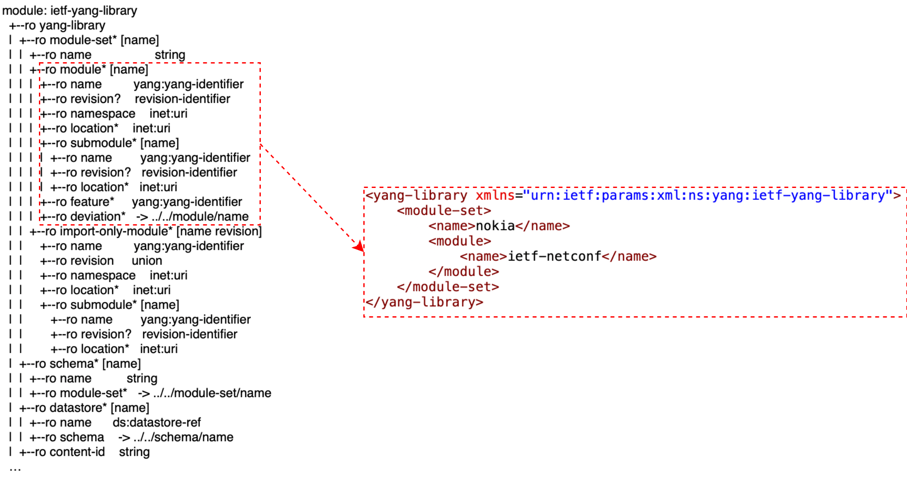

> **RDSV/SDNV**
>
> Curso 2025-26


<!-- omit from toc -->
Laboratorio de programación de redes basada en modelos YANG
===========================================================

> Última actualización de la práctica: 15 de octubre de 2025


<!-- omit from toc -->
# Tabla de contenidos
- [Introducción](#introducción)
- [Entorno de trabajo y requisitos *software*](#entorno-de-trabajo-y-requisitos-software)
- [Configuración del entorno](#configuración-del-entorno)
- [Desarrollo de la práctica](#desarrollo-de-la-práctica)
  - [1. YANG, descubrimiento de capacidades y consultas de datos de configuración y estado](#1-yang-descubrimiento-de-capacidades-y-consultas-de-datos-de-configuración-y-estado)
    - [1.1. Capacidades de gestión de Nokia SR Linux con NETCONF y fuentes de la verdad para YANG](#11-capacidades-de-gestión-de-nokia-sr-linux-con-netconf-y-fuentes-de-la-verdad-para-yang)
    - [1.2. Capacidades de gestión de Nokia SR Linux con gNMI y captura de tráfico de gestión](#12-capacidades-de-gestión-de-nokia-sr-linux-con-gnmi-y-captura-de-tráfico-de-gestión)
  - [2. Utilidades para examinar topología de red y configuración de red basada en modelos con gNMI](#2-utilidades-para-examinar-topología-de-red-y-configuración-de-red-basada-en-modelos-con-gnmi)
  - [3. *Model-Driven Telemetry* con gNMI](#3-model-driven-telemetry-con-gnmi)
  - [4. Conclusiones](#4-conclusiones)
  - [5. Entrega](#5-entrega)
- [Referencias](#referencias)


# Introducción

El objetivo de esta práctica es familiarizarse con la gestión de red basada en modelos YANG y protocolos de gestión de red afines como gNMI y NETCONF.

En esta práctica se desplegarán diferentes escenarios de red utilizando
[Containerlab](https://containerlab.dev/), una herramienta de virtualización que permitirá la creación y gestión de escenarios de red virtuales basadas en contenedores. Los routers de la red se implementarán con [SR Linux](https://learn.srlinux.dev/), un sistema operativo de red desarrollado por Nokia para entornos virtualizados basados en contenedores que implementan gestión de red basada en modelos YANG. Esto facilitará la emulación de entornos de virtualización de infraestructuras de red realistas para practicar con la gestión y telemetría de red basada en modelos. 

Una vez desplegados los escenarios, se trabajará con los modelos YANG para
comprender su estructura y su papel en la descripción de la configuración y el estado de los equipos de red Nokia SR Linux, así como en el uso de protocolos de gestión como NETCONF y gNMI para poder consultar dicha información.

Posteriormente, se explorarán los mecanismos de configuración de red basada en modelos, aplicando cambios de manera programática mediante el protocolo gNMI.

Finalmente, se abordará el uso de mecanismos de telemetría basada en modelos (*Model-Driven Telemetry* o MDT), lo que permitirá la recolección y el análisis dinámico de datos de la red en tiempo real. 

Esta aproximación demostrará las ventajas de los modelos YANG y de los protocolos de gestión de red relacionados para la automatización y la observabilidad de las redes.

# Entorno de trabajo y requisitos *software*

Como se ha introducido, en las actividades de esta práctica se utilizará la plataforma de virtualización Containerlab para desplegar escenarios de red cuyos equipos estarán virtualizados como contenedores Docker. Existen diferentes alternativas para interactuar con los contenedores de los escenarios de red virtualizados con Containerlab que serán desplegados en esta práctica, dependiendo del tipo de contenedor.

Habrá contenedores que sean equipos de red de tipo Nokia SR Linux que harán de routers, los cuales implementan la capacidad de ser gestionados mediante protocolos de gestión de red basada en modelos YANG. Para estos contenedores, tenemos dos modalidades de acceso:
- Acceder a la CLI propia del sistema operativo de Nokia SR Linux. Para ello, tendremos dos opciones:
  - Via SSH (usuario `admin` y contraseña `NokiaSrl1!`) mediante el siguiente comando
    ```bash
    ssh admin@<container_name>
    ```
    , siendo `<container_name>` el nombre del contenedor. Para listar los contenedores del escenario de Containerlab desplegado puede utilizar el siguiente comando:
    ```bash
    docker ps -a
    ```
  - Via comando `docker exec`:
    ```bash
    docker exec -it <container_name> sr_cli
    ```
- Acceder a la terminal de *shell* interactiva de Linux via comando `docker exec`:
  ```bash
  docker exec -it <container_name> bash
  ```

El resto de contenedores actuarán como *hosts* de tipo Linux. Para estos contenedores, la modalidad de acceso es abrir una terminal de *shell* interactiva propia de Linux con un comando de tipo `docker exec` como el anterior.

A continuación, se resaltan los requisitos *software* necesarios para realizar esta práctica (se distribuye una máquina virtual que cumple con todos estos requisitos):

- [Docker](https://docs.docker.com/engine/install/). Probado con la versión 28.1.1.
- [Docker Compose](https://docs.docker.com/compose/install/). Probado con la versión v2.35.1.
- [Containerlab](https://containerlab.dev/install/). Probado con la versión 0.70.2.
- Imagen Docker de router Nokia SR Linux [`ghcr.io/nokia/srlinux`](https://github.com/nokia/srlinux-container-image) (probado con la última versión disponible 25.7.2).
- Otras imágenes Docker:
  - Imagen ligera de Linux [`wbitt/network-multitool`](wbitt/network-multitool) (probado con la última versión). 
  -  Imagen para el cliente gNMIc [`ghcr.io/openconfig/gnmic`]([ghcr.io/openconfig/gnmic](https://github.com/openconfig/gnmic/pkgs/container/gnmic)) (probado con última versión disponible).
  - Imagen del servicio Apache Kafka [`wurstmeister/kafka`](https://hub.docker.com/r/wurstmeister/kafka) (probado con última versión disponible). 
  - Imagen del servicio Apache Zookeeper [`zookeeper`](https://hub.docker.com/_/zookeeper) (probado con última versión disponible).
  - Imagen del servicio Prometheus [`prom/prometheus`](https://hub.docker.com/r/prom/prometheus) (probado con última versión disponible).
  - Imagen del servicio Consul [`hashicorp/consul`](https://hub.docker.com/r/hashicorp/consul) (probado con última versión disponible).
- Cliente [`gNMIc`](https://gnmic.openconfig.net/install/). Probado con la versión 0.42.0.
- Python 3 (probado con la versión Python 3.10.12).
- Librería Python para cliente NETCONF denominada [`ncclient`](https://github.com/ncclient/ncclient).
- Librería Python [`pyang`](https://github.com/mbj4668/pyang) (probado con la versión 2.7.1) y extensión [`pyang-xpath`](https://github.com/NSO-developer/pyang-xpath).
- Java 11 (probado con OpenJDK versión 11.0.28)

# Configuración del entorno
Para realizar la práctica debe utilizar una máquina virtual distinta a la de las
prácticas anteriores.

Si utiliza un PC del laboratorio, siga los siguientes pasos: 

Para descargar y arrancar la máquina virtual, ejecute lo siguiente:

```bash
/lab/rdsv/bin/get-yanglab-vm
```

Una vez arrancada la máquina virtual, abra un terminal y descargue en el escritorio el repositorio de la práctica: 

```
cd ~/Desktop/
git clone https://github.com/educaredes/yang-lab.git
```

>**Nota:** No debe descargar el repositorio en una carpeta compartida, ya que en ese caso no arrancan correctamente los escenarios de Containerlab

Se recomienda utilizar el entorno de desarrollo o IDE de Visual Studio Code (VS Code) para realizar la práctica, ya que facilitará gestionar la configuración de *scripts* sobre el repositorio de la práctica así como la ejecución de comandos sobre la terminal de Linux todo integrado sobre la misma ventana de trabajo. Para abrir VS Code con el repositorio puede utilizar:

```
cd ~/Desktop/
code yang-lab/
```

Dentro de yang-lab encontrará una carpeta [`activities`](../activities/) con las tres actividades a realizar en esta práctica, separada en tres módulos diferenciados (es decir, [`module-1`](../activities/module-1/), [`module-2`](../activities/module-2/) y [`module-3`](../activities/module-3/)).

Opcionalmente, se recomienda instalar y utilizar la extensión de VS Code para Containerlab (https://marketplace.visualstudio.com/items?itemName=srl-labs.vscode-containerlab). Esta facilita el control de escenarios de red desplegados con Containerlab, así como el acceso automático a los terminales de los contenedores asociados y la representación gráfica de la topología de red resultante.

# Desarrollo de la práctica

## 1. YANG, descubrimiento de capacidades y consultas de datos de configuración y estado

En esta primera actividad se practicará con dos de los principales protocolos de gestión de red basada en modelos YANG, NETCONF y gNMI, para descubrir las capacidades que soportan los equipos de red Nokia SR Linux a nivel de gestión con YANG.

Inicialmente, pondremos a prueba la gestión con NETCONF y a continuación con gNMI.

Para empezar esta actividad, acceda al directorio [`module-1`](../activities/module-1/) del repositorio de trabajo y ejecute el siguiente *script* para arrancar y configurar el escenario de red virtualizado de Containerlab que utilizaremos:

```bash 
./deploy-srlinux-testbed.sh 
```

La topología de red consta de cuatro contenedores: dos routers Nokia SR Linux (`r1` y `r2`) conectados mediante un enlace Ethernet punto a punto, y dos hosts Linux (`pc1` y `pc2`) conectados mediante redes LAN a cada dispositivo router. El escenario de red está configurado para tener conectividad punto a punto entre los hosts. Todos los nodos también están conectados con sus interfaces de gestión a la red Docker de Containerlab. Las interfaces de gestión de los routers serán las utilizadas para realizar su gestión por los protocolos NETCONF y gNMI.



### 1.1. Capacidades de gestión de Nokia SR Linux con NETCONF y fuentes de la verdad para YANG

Empezando por NETCONF, como se ha visto en la teoría, al abrir la sesión inicialmente entre cliente y servidor ambos envían mensajes de tipo *`<hello>`* para el intercambio de información de capacidades, tales como modelos YANG implementados por el servidor o funciones adicionales del protocolo desde el lado del cliente y servidor.

Para ver un ejemplo del mensaje de tipo *`<hello>`* que envía el servidor YANG al iniciar una sesión con NETCONF, podemos arrancar una conexión SSH hacia el puerto de administración de NETCONF (830) para uno de los contenedores de Nokia SR Linux mediante el siguiente comando:
```bash 
ssh -p 830 admin@<container_name> -s netconf
```
>**Nota:** La contraseña es `NokiaSrl1!`

Se observará una llegada del mensaje de tipo *`<hello>`* desde el servidor, quedando a la espera del mensaje de *`<hello>`* con las capacidades soportadas desde el lado del cliente antes de poder entonces realizar cualquier operación RPC.

Sin embargo, este mensaje para intercambiar capacidades puede ser útil no sólo al comienzo de la sesión por NETCONF sino en cualquier otro momento dado. Para ello, los clientes de NETCONF permiten invocar operaciones de descubrimiento de capacidades de servidores YANG. En concreto, veremos un ejemplo con el cliente [`ncclient`](https://github.com/ncclient/ncclient) de Python.

Probaremos un *script* [`get-capabilities-srlinux.py`](../activities/module-1/get-capabilities-srlinux.py) en Python que devuelve las capacidades con NETCONF. Ejecute el script de la siguiente manera:
```bash 
python get-capabilities-srlinux.py <container_name>
```

:point_right: **Pregunta 1:** Analice el resultado de ejecutar el *script* y el propio código del *script* y determine qué información se provee. Entre las capacidades adicionales que se advierten a modo de características o *features* del servidor NETCONF, determine si hay alguna que advierta de si se pueden realizar operaciones con operando de tipo *XPath*, si permite subscripción dinámica basada en mecanismo YANG Push o si permite configurar el propio equipo de red con sentencias RPC de tipo *`<edit-config>`* mediante NETCONF (característica *writeable-running*). ¿Soporta dichas características el cliente ncclient? Entre las capacidades anunciadas por NETCONF, el equipo anuncia los modelos YANG que implementa. Determine cuántos de los modelos son propietarios de Nokia SR Linux, cuántos estandarizados por el IETF y cuántos definidos por OpenConfig. Justifique sus respuestas.

[>**Nota LBT**: Se podría preguntar por el número de modelos propietarios, de IETF, y openconfig (pueden hacer grep y wc sobre el resultado)]: # (COMENTADO)

[Busque además entre los modelos YANG soportados, y encuentre alguno que determine si implementa arquitectura NMDA para separar en *datastores* diferenciados los datos de configuración y estado operativo. ¿Tiene sentido que lo implemente según la no disponibilidad para configurar el equipo con NETCONF? ¿A qué puede deberse?]: # (COMENTADO)

Para examinar los modelos YANG que implementa un equipo, hay varias alternativas de hacerlo como hemos comentado en la teoría: repositorios de modelos YANG, YANG *catalogs* o YANG *explorers*.

En primer lugar, existe la posibilidad de consultar repositorios públicos de modelos YANG. Al hacer la consulta de las capacidades YANG desde el lado del servidor, habrá observado que la mayoría de modelos y módulos YANG que implementa el router Nokia SR Linux son propietarios, aunque también implementa algunos modelos YANG definidos por el IETF y por OpenConfig. Eche un vistazo a los siguientes repositorios públicos en GitHub de módulos dependiendo de su organismo de definición:
- Modelos YANG definidos por IETF: https://github.com/YangModels/yang
- Modelos YANG definidos por OpenConfig: https://github.com/openconfig/public/tree/master/release
- Modelos YANG propietarios definidos por Nokia SR Linux: https://github.com/nokia/srlinux-yang-models

>**Nota:** En concreto, para el repositorio de modelos YANG propietarios de Nokia SR Linux, tal como se describe en el [README](https://github.com/nokia/srlinux-yang-models/blob/main/README.md) del repositorio, para ver los módulos YANG de una versión determinada, seleccione la etiqueta o *tag* del repositorio que coincida con la versión del equipo Nokia SR Linux.

En segundo lugar, existen herramientas de catálogos o sistemas de búsqueda para extraer metadatos de módulos YANG. Del mismo modo, dependiendo del organismo de definición de modelos YANG, existen diferentes herramientas:
- [YANG Catalog](https://www.yangcatalog.org/home.html) del IETF que permite, entre otras cosas, buscar, obtener y analizar información detallada, y ver el impacto o dependencia entre modelos YANG. También provee representaciones esquematizadas en forma de árbol de los modelos YANG (según RFC ) para facilitar su análisis.
- [Catálogo de modelos YANG de OpenConfig](https://www.openconfig.net/projects/models/) que de forma similar permite obtener documentación de los diferentes modelos YANG, así como proporcionar rutas o  *paths* de consulta para los datos modelados y representación esquematizada en forma de árbol de los diferentes módulos implementados.
- [YANG Browser](https://yang.srlinux.dev/) de Nokia SR Linux (para su documentación detallada vaya al siguiente enlace: https://learn.srlinux.dev/yang/browser). Este catálogo, aunque propietario, es muy completo, permitiendo analizar información de modelos YANG dependiendo de la versión y modelo de plataforma del equipo Nokia SR Linux consultado. Además, proporciona visualización muy amigable para consultar los modelos con utilidades para navegar a través de rutas o *paths* o a través de la representación de árbol de los modelos YANG.

Por último, tenemos la opción de consultar información de los modelos YANG con herramientas de tipo *explorers* que permiten interoperar con los equipos que implementan modelos YANG usando NETCONF o gNMI para extraer sus capacidades y recabar información. Existen herramientas públicas como [YANG Suite](https://developer.cisco.com/yangsuite/) o [ANX](https://github.com/cisco-ie/anx). Sin embargo, valdría cualquier solución *software* que integre clientes NETCONF o gNMI para consultar esa información, justo lo que estamos evaluando en esta actividad.

En concreto, NETCONF tiene la posibilidad de consultar el esquema completo de representación de un módulo YANG concreto implementado por un equipo. Probemos para ello un *script* [`download-yang-modules-schemas-srlinux.py`](../activities/module-1/download-yang-modules-schemas-srlinux.py) en Python que, consultando los diferentes módulos YANG implementados por un equipo Nokia SR Linux, extrae sus esquemas de representación y los descarga como ficheros `.yang` a una carpeta `yang-models-srlinux`. Ejecute el *script* de la siguiente manera:
```bash 
python download-yang-modules-schemas-srlinux.py <container_name>
```

De esta forma, con un simple *script* de Python tenemos una solución de tipo *explorer* que permite inferir los diferentes modelos YANG de un equipo, consultando sus capacidades, y generar un catálogo de módulos YANG local. 

Además, como ya se ha visto en la teoría, existen librerías que permiten analizar o procesar mejor módulos y datos modelados según modelos YANG. Analicemos ahora la posibilidad de la librería de Python [*`pyang`*](https://github.com/mbj4668/pyang) para analizar módulos YANG. Esta es la herramienta que utilizan los catálogos de modelos YANG mencionados para incluir representaciones esquematizadas de los modelos YANG. Veamos cómo lo hacen.

Vaya a la carpeta `yang-models-srlinux` creada con los modelos YANG generados y ejecute el siguiente comando de la herramienta *pyang* para generar la representación en forma de árbol del módulo YANG `ietf-yang-library@2019-01-04.yang`:
```bash 
pyang -f tree ietf-yang-library@2019-01-04.yang
```

También puede obtener una representación de los diferentes *paths* para navegar por los datos modelados en un modelo mediante la siguiente opción del comando:
```bash 
pyang -f xpath ietf-yang-library@2019-01-04.yang
```

Evaluemos el resultado de consultar información de ese módulo YANG con NETCONF. Realizaremos una consulta RPC de tipo GET para ello. Utilizaremos para ello el script [`get-rpc-yang-library-srlinux.py`](../activities/module-1/get-rpc-yang-library-srlinux.py). Ejecútelo de la siguiente manera:
```bash 
python get-rpc-yang-library-srlinux.py <container_name>
```
>**Nota**: Si no puede ver todo el contenido de la respuesta en la terminal, redirija la salida a un fichero, añadiendo `> get-rpc-yang-library-srlinux-output.xml` al comando anterior.

Revise el *script* y evalúe cómo se realiza la consulta RPC de tipo GET mediante un filtro de tipo *subtree* a modo de esquema de datos XML donde se consulta todo el contenido del modelo YANG partiendo de su raíz en su estructura de árbol. Examine además cómo se incluye en el filtro definido el identificador unívoco o *namespace* del modelo YANG examinado.

:point_right: **Pregunta 2:** Con los resultados obtenidos con la consulta de este módulo YANG `ietf-yang-library@2019-01-04.yang` a partir de la herramienta *pyang*, analizando el contenido del esquema del propio módulo, y con el resultado de la consulta RPC de tipo GET realizada con el *script* de Python, determine la utilidad o propósito del módulo YANG en cuestión. ¿Tiene alguna relación con la operación de obtener las capacidades del equipo? Consulte dentro del modelo YANG la información sobre el nodo de datos *datastore* y compruebe la salida obtenida al realizar la consulta RPC de tipo GET. ¿Qué *datastores* implementa el equipo Nokia SR Linux? ¿Implementa la arquitectura NMDA para diferenciar datos de configuración y estado operativo? En caso positivo, determine si entre los modelos YANG soportados, existe un módulo YANG asociado a arquitectura NMDA y con las herramientas vistas consulte su información y determine su propósito. Justifique sus respuestas.

En el siguiente diagrama, se incluye un ejemplo de cómo construir un filtro de tipo *subtree* para consultar información más concreta proveniendo del módulo YANG `ietf-yang-library@2019-01-04.yang`. En concreto, vemos cómo definir un filtro que permita obtener sólo información del módulo YANG `ietf-netconf` implementado por el equipo de red. A la izquierda vemos el diagrama de representación parcial en forma de árbol que devuelve la herramienta *pyang* que nos facilita saber cómo navegar por los datos del modelo para construir el filtro *subtree*. El diagrama en forma de árbol además nos permite identificar con el carácter `*` seguido de `[]` que los nodos `module-set` y `module` son nodos de datos de tipo `list` y que tienen otros nodos `name` que hacen de índice para recorrer su información. Estos índices son aplicados en el filtro *subtree* para navegar por los datos del modelo YANG.



Prueba a cambiar el filtro de tipo *subtree* en el *script*[`get-rpc-yang-library-srlinux.py`](../activities/module-1/get-rpc-yang-library-srlinux.py) y vea cómo ahora se proporciona información relativa sólo al modelo `ietf-netconf`.

Una vez evaluadas las capacidades del equipo de red Nokia SR Linux con NETCONF, evaluaremos con el mismo protocolo de gestión de red cómo realizar consultas RPC concretas para datos operativos o de configuración. Para ello, pondremos como caso de uso evaluar datos operativos y de configuración de una interfaz concreta de red del equipo utilizando un modelo YANG propietario del equipo Nokia SR Linux para dicho propósito.

>**Nota:** Verá que el equipo implementa modelos YANG normalizados por el IETF y OpenConfig para ello. Sin embargo, no son operativos para la versión de equipo Nokia SR Linux *open-source* utilizada. Para su uso, hace falta una licencia con subscripción de pago asociada.

:point_right: **Pregunta 3:** Una vez encontrado el modelo YANG en cuestión, partiendo del ejemplo del *script* `get-rpc-yang-library-srlinux.py` utilizado anteriormente, cree los dos nuevos *scripts* siguientes: 1) `get-rpc-interface-srlinux.py` para realizar una consulta RPC de tipo GET que obtenga los datos operativos de la interfaz de red `ethernet-1/1` de un equipo Nokia SR Linux y 2) `get-config-rpc-interface-srlinux.py` para realizar una consulta RPC de tipo GET-CONFIG que obtenga los datos de configuración de la interfaz de red `ethernet-1/1` de un equipo Nokia SR Linux. Incluya los dos scripts en la entrega asociada a esta práctica. ¿A qué *datastore* se accede en cada consulta? 

>**Nota:** Para definir la operación GET-CONFIG consulte la API del cliente ncclient en su repositorio oficial (https://github.com/ncclient/ncclient/tree/master/ncclient). En concreto, vea como en el módulo Python [`manager.py`](https://github.com/ncclient/ncclient/blob/master/ncclient/manager.py) que se usa para inicializar la sesión de NETCONF se incluyen los diferentes tipos de operaciones (entre ellas *get_config*) importando los módulos del directorio [`operations`](https://github.com/ncclient/ncclient/tree/master/ncclient/operations) donde se definen las clases que estructuran  cada tipo de operación. Vaya en concreto al módulo [`retrieve`](https://github.com/ncclient/ncclient/blob/master/ncclient/operations/retrieve.py) y vea la estructura de la clase asociada a *get_config* para ver cómo se debe de especificar la operación.

>**Nota:** En las diapositivas de la teoría hay ejemplos para las consultas RPC de tipo GET y GET-CONFIG con ncclient para extraer datos de estado y configuración de las interfaces de red de un equipo que pueden servir de ayuda. Tenga en cuenta que los ejemplos están definidos en base al modelo YANG estandarizado por el IETF denominado `ietf-interfaces` (en concreto para su revisión `2014-05-08` que no tiene soporte para arquitectura NMDA), y no para el modelo YANG propietario de Nokia SR Linux. 

### 1.2. Capacidades de gestión de Nokia SR Linux con gNMI y captura de tráfico de gestión

Una vez evaluada las capacidades de los equipos Nokia SR Linux con el protocolo NETCONF, analizaremos ahora de forma similar las prestaciones del protocolo gNMI. Para ello, utilizaremos el cliente CLI promovido por OpenConfig denominado [`gNMIc`](https://gnmic.openconfig.net/). 

Como distinción con NETCONF al realizar una sesión por gNMI, no se requiere una fase de negociación o *handshake* con mensajes de tipo *`<hello>`* previa a realizar cualquier operación RPC para el intercambio de capacidades entre cliente y servidor. En gNMI el cliente no tiene que proporcionar capacidades al servidor. Sin embargo, existe la operación de obtener las capacidades del servidor gNMI y se recomienda realizarla al gestionar inicialmente un equipo con este protocolo.

Para ver cómo funciona esta operación de consulta de las capacidades con gNMI, realice la siguiente operación para uno de los equipos Nokia SR Linux disponibles:
```bash 
gnmic -a <container_name>:57400 -u admin -p NokiaSrl1! --skip-verify capabilities
```

:point_right: **Pregunta 4:** Examine la respuesta de las capacidades y determine la información proporcionada. Compare el resultado con el de la operación de capacidades realizada con NETCONF. ¿En gNMI se anuncian capacidades operativas más allá de los modelos YANG? ¿Observa diferencia entre los modelos que devuelve gNMI frente a NETCONF al determinar sus capacidades? ¿Hay negociación de versión del protocolo y formato de codificación de datos implícita en NETCONF? Justifique sus respuestas.

Probemos a realizar consultas de tipo *`get`* través del cliente gNMIc. Probemos primer a consultar la información del modelo YANG `ietf-yang-library@2019-01-04.yang` a partir del gNMI. Para ello, realice la consulta del siguiente modo para obtener sólo la información que proporciona el modelo de los *datastores*:
```bash 
gnmic -a <container_name>:57400 -u admin -p NokiaSrl1! get --path "/yang-library/datastore" --skip-verify --encoding JSON_IETF
```
Observe que el operando para realizar la consulta es a modo de *path* estructurado que navega por el modelo YANG en cuestión para recabar información de un nodo de datos concreto (es decir, del nodo *`datastore`*). 

>**Nota**: En esencia, el filtro *path* que utiliza gNMI para navegar por datos estructurados de acuerdo a modelos YANG es muy similar al filtro *XPath* utilizado en NETCONF para navegar por datos codificados en XML y modelados con YANG, diferenciándose principalmente en que gNMI usa una representación interna codificada en Protobuf para procesar esos *paths*. Para más información sobre el filtro *XPath* puede consultar la especificación [*XML Path Language (XPath) Version 1.0*](https://www.w3.org/TR/1999/REC-xpath-19991116/) definida por W3C (*World Wide Web Consortium*) y acogida por YANG y el protocolo NETCONF según se recoge en la sección [*6.4. XPath Evaluations*](https://datatracker.ietf.org/doc/html/rfc7950#section-6.4) de la RFC 7950 - *"The YANG 1.1 Data Modeling Language"* y en la sección [*8.9. XPath Capability*](https://datatracker.ietf.org/doc/html/rfc7950#section-6.4) de la RFC 6241 - *"Network Configuration Protocol (NETCONF)"* definidas por el IETF. En cambio, para la definición del filtro *path* utilizado en gNMI, puede encontrar más información en la propia especificación del protocolo definida por OpenConfig en la sección [*2.2.2 Paths*](https://www.openconfig.net/docs/gnmi/gnmi-specification/#222-paths) y en material complementario a la especificación [*Schema path encoding conventions for gNMI*](https://github.com/openconfig/reference/blob/master/rpc/gnmi/gnmi-path-conventions.md) y [*Representing gNMI Paths as Strings*](https://github.com/openconfig/reference/blob/master/rpc/gnmi/gnmi-path-strings.md).


En el siguiente diagrama, se incluye un ejemplo de cómo construir un filtro de tipo *path* para consultar información más concreta proveniendo del módulo YANG `ietf-yang-library@2019-01-04.yang`, similar al ejemplo con filtro *subtree* que veíamos con NECONF. En concreto, vemos de nuevo cómo definir un filtro que permita obtener sólo información del módulo YANG `ietf-netconf` implementado por el equipo de red. A la izquierda se vuelve a representar el diagrama parcial en forma de árbol que devuelve la herramienta *pyang* que nos facilita saber cómo navegar por los datos del modelo para construir el filtro *path*.


A continuación, de forma similar a como se proponía en el apartado de NETCONF, se propone realizar las consultas de datos de estado operativo y de configuración de una interfaz concreta de un equipo Nokia SR Linux.

:point_right: **Pregunta 5:** A partir del modelo YANG apropiado, defina las dos consultas de tipo *`get`* correspondientes con gNMIc e incluya la ejecución exitosa de ambas consultas en la memoria de la práctica. Consulte las utilidades del *YANG Browser* de Nokia SR Linux o de la librería *pyang* para encontrar los *paths* de consulta del modelo YANG en cuestión. Busque las opciones del cliente gNMIc para operaciones de consulta de tipo *`get`* (revise la siguiente documentación: https://gnmic.openconfig.net/cmd/get/) para saber cómo indicar si se desean obtener datos de configuración o de estado operativo. ¿La respuesta de las dos consultas coincide con lo esperado según el modelo YANG de referencia y con lo que devolvían las operaciones RPC de tipo GET y GET-CONFIG de NETCONF? Justifique su respuesta.

A continuación, veremos cómo capturar el tráfico de señalización intercambiado entre cliente y servidor al realizar operaciones con el protocolo de gestión gNMI. Para ello, en uno de los contenedores de los routers Nokia SR Linux pondremos a capturar tráfico con la herramienta `tcpdump` en la interfaz de red `mgmt0` que conecta a la red de gestión de Containerlab por donde pasa el tráfico de gestión con gNMI. Acceda a la terminal de *shell* del contenedor asociado ya sea a través de del *plugin* de VSCode para Containerlab o mediante el siguiente comando:
```bash 
docker exec -it <container_name> bash
```

Una vez dentro de la consola de contenedor, arranque la captura de tráfico con `tcpdump` en la interfaz `mgmt0` del contenedor incluyendo la opción para que guarde la captura en un fichero `gnmi-traffic.pcap` mediante el siguiente comando:
```bash 
tcpdump -i mgmt0 -w gnmi-traffic.pcap
```

Mientras está activa la captura de tráfico, realizaremos las consultas con gNMI ejecutadas anteriormente para obtener las capacidades del router y para consultar el estado operativo de una de sus interfaces de red. Sin embargo, deberemos incluir la opción `--log-tls-secret` al comando de gNMIc para que registre en un fichero el secreto compartido TLS de la sesión y que permitirá descifrar la comunicación gNMI protegida por TLS al capturar tráfico. Por cada operación consultada con gNMI se generará un secreto TLS diferente bajo un fichero con el nombre  `<container_name>:57400.tlssecret`. El fichero generado con la primera consulta renómbrelo como `<container_name>-capabilities.tlssecret` mientras que el fichero generado con la segunda consulta renómbrelo como `<container_name>-get-rpc.tlssecret`.

Una vez completadas las consultas y guardados los ficheros de secreto TLS de cada una de ellas, pare la captura de tráfico y recupere el fichero `gnmi-traffic.pcap` desde la máquina virtual utilizando el siguiente comando:
```bash 
docker cp <container_name>:gnmi-traffic.pcap .
```

Ahora, abriremos la aplicación Wireshark para analizar en detalle el tráfico capturado, utilizando el siguiente comando:
```bash 
sudo wireshark <container_name>:gnmi-traffic.pcap &
```

Al analizar el tráfico capturado encontrará tráfico TLS producto de las sesiones por gNMI. Para descifrarlo, tendremos que incluir el secreto compartido concreto. En primer lugar, seleccione el secreto TLS producto de la operación de extracción de capacidades. Para ello, vaya al panel de preferencias de Wireshark yendo a la barra de herramientas y seleccionando *"Edit > Preferences..."*. Una vez en el panel de preferencias, en la barra lateral despliegue la lista de protocolos y seleccione TLS. Vaya a la opción *"(Pre)-Master-Secreto log filename"* y pulsando en *"Browse..."* seleccione el fichero con el secreto TLS asociado. Mantenga el resto de opciones marcadas por defecto y pulse el botón de OK.

Ahora, podrá ver que se ha descifrado el tráfico TLS y se encontrará tráfico HTTP/2 y gRPC producto de la sesión gNMI. Como se ha visto en la teoría el transporte de los mensajes en la sesión gNMI está codificado en formato Protobuf, pese a que los datos sean solicitados en formato JSON. A continuación, decodificaremos los paquetes codificados según Protobuf para hacer más legible los datos en los mensajes intercambiados entre cliente y servidor. Para ello, vaya de nuevo al panel de preferencias de Wireshark y seleccione Protobuf en la lista de protocolos. Vaya entonces a la opción *"Protobuf search paths"* y pulse la opción *"Edit..."*. Pulsando el botón `+` y en la nueva fila generada en la tabla superior haga doble *click* en la celda debajo de *"Protobuf source directory"* y pulse en los `...` seleccionando el directorio `/home/upm/gnmi4wireshark`. Luego, marque la casilla de la celda de la derecha bajo la columna *"Load all files"*. Dale al botón de OK. En las preferencias de Protocol Buffers mantenga los valores marcados por defecto y seleccione de nuevo el botón OK.

>**Nota**: En `/home/upm/gnmi4wireshark` se encuentran los ficheros en formato .proto que permiten decodificar los mensajes en Protobuf intercambiados por gNMI. Estos ficheros .proto han sido obtenidos de la siguiente fuente de información: https://github.com/hellt/gnmi4wireshark.

:point_right: **Pregunta 6:** Busque primero los paquetes HTTP/2 y gRPC asociados a la operación gNMI de consulta de capacidades. Incluya una captura de pantalla del paquete HTTP/2 en la memoria y describa aquellas cabeceras asociadas a los parámetros de la consulta establecida originalmente mediante gNMI. Para la respuesta, encuentre el paquete gRPC del mensaje de capacidades resultante y determine la cabecera Protobuf con los campos asociados a la versión de gNMI usada, la lista de modelos YANG implementados por el servidor y los formatos de codificación consultados, incluyendo una captura de pantalla representativa en la memoria. Describa brevemente la información mostrada en las capturas de pantalla.

:point_right: **Pregunta 7:** Repita el proceso para la operación GET de consulta de estado de la interfaz del router. Ahora, sobre la misma captura de tráfico, sólo tendrá que cambiar el fichero del secreto compartido TLS asociado a la operación, pudiendo mantener la configuración de decodificación de Protobuf. Encuentre el paquete gRPC original de la petición GET y yendo a la cabecera Protobuf determine los campos del mensaje e incluya una captura de pantalla asociada en la memoria. Encuentre luego el paquete gRPC de la respuesta y busque en la cabecera Protobuf el mensaje con la respuesta asociada a la petición GET, incluyendo captura de pantalla representativa en la memoria. Describa brevemente la información mostrada en las capturas de pantalla.

>**Nota**: Incluya tanto la captura de tráfico como los ficheros de secreto compartido TLS utilizados para dar respuesta a las **Preguntas 6 y 7** en la entrega asociada a esta práctica.

Una vez terminada la actividad, destruya el escenario de red virtualizado de Containerlab mediante la ejecución del siguiente *script*:
```bash 
./destroy-srlinux-testbed.sh
```

## 2. Utilidades para examinar topología de red y configuración de red basada en modelos con gNMI   

En esta segunda actividad, se desplegará un nuevo escenario de red virtualizado con Containerlab pero su configuración de red estará incompleta. El objetivo será utilizar las capacidades del protocolo gNMI para configurar remotamente los equipos de la red. La configuración a completar será relativa al direccionamiento y encaminamiento IP entre los routers del escenario desplegado.

Además, como apoyo a esta actividad, previamente se analizarán utilidades para examinar mejor la topología de red desplegada y facilitar así la configuración de la red.

Para empezar esta actividad, acceda al directorio [`module-2`](../activities/module-2/) del repositorio de trabajo y ejecute el siguiente *script* para arrancar y configurar el escenario de red virtualizado de Containerlab que utilizaremos:
```bash 
./deploy-routing-testbed.sh 
```

Una vez desplegado el escenario, evalúe la topología de red y la configuración de red realizada en el escenario. Para ello, analice primero el *script* de despliegue, determinando la plantilla en formato YAML que especifica la interconexión de los equipos que conforman el escenario de red, así como los archivos de configuración utilizados para arrancar los equipos Nokia SR Linux utilizados con una configuración base. Además, analice la configuración extra realizada en el *script* de despliegue para la configuración de direccionamiento y encaminamiento IP en los *hosts* del escenario. Para hallar el diagrama de la topología de red puede ayudarse de dos utilidades de Containerlab:
- Utilizar la extensión de VS Code para Containerlab (https://marketplace.visualstudio.com/items?itemName=srl-labs.vscode-containerlab) que, entre otras cosas, permite representar gráficamente la topología de red de un escenario de Containerlab desplegado.
- Utilizar la opción `graph` de Containerlab para proporcionar una representación gráfica de la topología de un escenario de especificación YAML definido a través de un servidor web integrado. Para ello, ejecute el siguiente comando:
  ```bash 
  containerlab graph --topo routing-testbed.yaml
  ```

Además, utilizaremos una aplicación Java que integra la librería [`YANG Tools`](https://github.com/opendaylight/yangtools) para normalizar datos del escenario de red desplegado según modelos YANG de referencia del IETF definidos en la [RFC 8345](https://www.rfc-editor.org/info/rfc8345). Para ejecutar la aplicación, introduzca el siguiente comando:
```bash 
java -jar topology-driver-1.0.jar clab-srlinux-testbed/topology-data.json output.json output.xml 
```

Examine la salida estándar que devuelve la ejecución de la aplicación, así cómo los fichero `output.json` y `output.xml` generados, analizando su contenido.

:point_right: **Pregunta 8:** Una vez analizado el nuevo escenario de red desplegado, añada en la memoria una breve descripción del mismo apoyándose en el uso capturas de pantalla si lo desea. ¿Qué función realiza la aplicación Java evaluada? ¿Qué utilidad podría tener para un controlador de red SDN que controle y gestión equipos con soporte para YANG? Justifique sus respuestas.

Como se ha introducido y se habrá verificado en el análisis previo realizado del escenario de red desplegado, falta por configurar el direccionamiento IP del las interfaces que interconectan los routers, así como el encaminamiento IP para permitir la conectividad entre los clientes o *hosts* extremos de la red. Para completar esta configuración realizaremos consultas de tipo *`set`* con el cliente gNMIc. 

Entre las opciones del cliente gNMIc para realizar solicitudes de tipo *`set`*, destaca la posibilidad de utilizar plantillas en formato YAML parametrizables y reutilizables que permitan simplificar y automatizar el proceso de configuración (para más detalles revise el apartado [*Templated Set Request file*](https://gnmic.openconfig.net/cmd/set/#templated-set-request-file) de la documentación de gNMIc para solicitudes de tipo *`set`*). Justo utilizaremos este tipo de plantillas para definir la estructura de configuración del direccionamiento IP y del encaminamiento IP de los routers del escenario. Tenemos por tanto dos plantillas diferentes: 1) [`configure_ip_address.yaml`](../activities/module-2/configure_ip_address.yaml) y 2) [`configure_ip_routing.yaml`](../activities/module-2/configure_ip_routing.yaml). Analizando estas plantillas, encontrará variables de entrada cuyos valores podrán ser parametrizados. Veamos cómo hacer esto. 

La solución recomendada es ejecutar el comando gNMIc de tipo *`set`* indicando previamente los pares variable-valor necesarios para la plantilla de solicitud en formato JSON. Se muestra a continuación un ejemplo genérico de ejecución del comando gNMIc para la configuración de direccionamiento IP de un router:
```bash 
echo '{"IF_NAME": "...", "IF_IP_PREFIX": "..."}' | gnmic -a <container_name>:57400 -u admin -p NokiaSrl1! --skip-verify set --request-file configure_ip_address.yaml --request-vars -
```
>**Nota**: Deberá sustituir los `...` por el valor adecuado.

Alternativamente, puede definir archivos de tipo JSON o YAML que incluyan la especificación de los pares variable-valor a utilizar por la plantilla en cada solicitud gNMIc de tipo *`set`*. Se incluye un ejemplo de los ficheros de especificación de variable-valor, primero en formato JSON y luego en formato YAML, para las variables necesarias en la plantilla `configure_ip_address.yaml`.
```bash 
# Ejemplo de fichero con extensión .json de definición de variables
{ 
  "IF_NAME": "...", 
  "IF_IP_PREFIX": "..."
}
```

```bash 
# Ejemplo de fichero con extensión .yaml de definición de variables
IF_NAME: ...
IF_IP_PREFIX: ...
```

Teniendo en cuenta esta forma de definir los valore de las variables a utilizar por la plantilla de configuración, se muestra a continuación un ejemplo genérico de ejecución del comando gNMIc para la configuración de direccionamiento IP de un router:
```bash 
gnmic -a <container_name>:57400 -u admin -p NokiaSrl1! --skip-verify set --request-file configure_ip_address.yaml --request-vars <fichero JSON/YAML de definición de variables>
```
>**Nota**: El problema de esta alternativa es que deberá definir archivos JSON/YAML específicos por cada ejecución del comando *`set`* de configuración con gNMIc.

Para la configuración de direccionamiento IP en los enlaces entre routers, se propone el siguiente plan de direccionamiento:

 | **Enlace** | **Dirección IP de subred**  |
|-----------------|----------------|
| **r1-r2**        | 10.10.10.0/30       | 
| **r1-r3**        | 10.10.11.0/30       |
| **r2-r3**        | 10.10.12.0/30       |

:point_right: **Pregunta 9:** Teniendo en cuenta estas directrices, deberá de definir un *shell script* general que permita automatizar las ejecuciones de los comandos de gNMIc de tipo *`set`* para la configuración de direccionamiento y encaminamiento IP de todos los routers del escenario. Para facilitar la tarea de cómo definir las variables necesarias para las consultas especificadas en las plantillas de configuración de las consultas gNMIc de tipo *`set`*, determine a qué modelos YANG propietarios de Nokia SR Linux apuntan los *paths* incluidos. Incluya el *script* en la entrega asociada a la práctica. Realice además pruebas de conectividad punto a punto entre los contenedores de los *hosts* extremos para verificar que la configuración de red es exitosa. Incluya captura de alguna de estas pruebas en la memoria.

:point_right: **Pregunta 10 (Opcional):** Como parte opcional, se plantea capturar y analizar el tráfico para una de las operaciones de configuración de red realizadas con gNMI. Siguiendo la metodología utilizada para las capturas de tráfico realizadas en el `module-1`, capture tráfico en la interfaz de gestión de uno de los routers Nokia SR Linux mientras realiza una de los comandos de tipo *`set`* con gNMIc. No se olvide de incluir ahora la opción`--log-tls-secret` al comando de gNMIc para que registre en un fichero el secreto compartido TLS. Renombre el fichero generado con la consulta como `<container_name>-edit-config-rpc.tlssecret`. Para analizar la captura de tráfico obtenida, sólo tendrá que cambiar el fichero del secreto compartido TLS asociado a la operación, pudiendo mantener la configuración de decodificación de Protobuf. Encuentre el paquete gRPC original de la petición de configuración y yendo a la cabecera Protobuf determine los campos del mensaje e incluya una captura de pantalla asociada en la memoria. Encuentre luego el paquete gRPC de la respuesta y busque en la cabecera Protobuf el mensaje que determine la respuesta exitosa asociada a la configuración del equipo, incluyendo captura de pantalla representativa en la memoria. Describa brevemente la información la información mostrada en las capturas de pantalla. Incluya en la entrega de la práctica tanto la captura de tráfico (renómbrela como `<container_name>-edit-config-rpc.pcap`) como el secreto compartido TLS asociado.

Una vez terminada la actividad no destruya el escenario de red desplegado con Containerlab pues servirá de base para la última actividad de la práctica.

## 3. *Model-Driven Telemetry* con gNMI

En esta última actividad, tomando el escenario de red de la actividad anterior como base, analizaremos las posibilidades del protocolo gNMI para realizar operaciones de subscripción sobre datos de estado operativo y de estadísticas de telemetría de red que permitan desencadenar notificaciones periódicas o basadas en cambios de estado. En definitiva, esta actividad nos permitirá evaluar mecanismos de telemetría de red basada en modelos YANG o *Model-Driven Telemetry*.

En primer lugar, determinaremos cómo realizar operaciones de subscripción básica con gNMIc que vuelquen las notificaciones generadas por salida estándar. Además, analizaremos el tráfico de gestión relativo a las notificaciones obtenidas mediante Wireshark.

En segundo lugar, configuraremos un sistema de telemetría que permita gestionar los datos monitorizados de todas las interfaces de uno de los routers producto de nuevas operaciones de subscripción. Para ello, volcaremos la salida de las notificaciones resultantes de las operaciones de subscripción tanto en un bus de mensajes basado en la solución de [`Apache Kafka`](https://kafka.apache.org/) como en una base de datos de series temporales como [`Prometheus`](https://prometheus.io/), dependiendo de ciertas condiciones de los tipos de subscripción definidas.

Para empezar esta actividad, acceda al directorio [`module-3`](../activities/module-3/).

Para la primera parte de la actividad, determinaremos cómo realizar operaciones de tipo *`subscribe`* con el cliente gNMIc. Aunque se pueden definir en una única línea de comando, utilizaremos de nuevo una plantilla YAML para la especificación de las subscripciones a realizar. La estructura de la plantilla se encuentra en el archivo [`gnmic-subscription.yaml`](../activities/module-3/gnmic-subscription.yaml) y tiene el siguiente contenido:
```bash
targets:
  router1:
    # gNMI target address; CLI flag `--address`
    address: "<container_name>:57400"
    # gNMI target user name; CLI flag `--username`
    username: admin
    # gNMI target user password; CLI flag `--password`
    password: NokiaSrl1!
    # do not verify the target certificate when using tls; CLI flag `--skip-verify`
    skip-verify: true
    log: true
    # log file location; CLI flag `--log-file`
    log-file: /tmp/gnmic.log
    subscriptions:
      - r1_traffic_stats_e1-1
      - r1_interface_status_e1-1

subscriptions:
  r1_traffic_stats_e1-1:
    paths:
       - "..."
    stream-mode: sample
    sample-interval: 5s
    encoding: JSON_IETF
    outputs: 
      - stdout-output
  r1_interface_status_e1-1:
    paths:
      - "..."
      - "..."
    stream-mode: on-change
    encoding: JSON_IETF
    outputs: 
      - stdout-output

outputs:
  stdout-output:
    type: file # output type
    file-type: stdout # or stderr
    # Exported msg format, json, protojson, prototext, proto, event
    format: event
```

Deberá cambiar los valores `<container_name>` y `<...>` convenientemente. En el apartado *paths* de la subscripción periódica `r1_traffic_stats` indicada, incluya el *path* que apunte las estadísticas de la interfaz de red `ethernet-1/1` del router `r1` del escenario (es decir, nodo de datos general de estadísticas perteneciente modelo YANG de Nokia SR Linux para datos de configuración y estado de interfaces de red visto y utilizado en actividades anteriores). En el apartado *paths* de la subscripción basada en cambios `r1_port_status`  indicada, incluye dos *paths*, uno que apunte al estado operativo de la interfaz de red `ethernet-1/1` y el otro que apunte al estado administrativo de la interfaz `ethernet-1/1` (determine para ello los nodos de datos relativos pertenecientes al modelo YANG de Nokia SR Linux para datos de configuración y estado de interfaces de red visto anteriormente).

Una vez definido el fichero de configuración de subscripciones, el comando gNMIc necesario para ejecutar la operación de tipo *`subscribe`* sería el siguiente:
```bash 
gnmic subscribe --config gnmic-subscription.yaml
```

Verifique si la operación de subscripción funciona según lo esperado y si recibe notificaciones periódicas o basadas en cambio de estado mientras tenga activo el comando. Para provocar cambios de estado que desencadenen notificaciones relativas a la subscripción `r1_port_stats` definida, se propone realizar una consulta con el cliente gNMIc de tipo *`set`* que modifique el estado administrativo de la interfaz. Para este tipo de acción con gNMIc, vale con realizar un comando de tipo *`set`* que incluya el *path* que apunte al nodo de datos que se quiere actualizar de un modelo YANG y el valor apropiado. Se incluye un ejemplo general del comando a continuación:
```bash 
gnmic -a <container_name>:57400 -u admin -p NokiaSrl1! --skip-verify set --update-path "<path>" --update-value <value>
```
, donde deberá cambiar los valores de `<container_name>`, `<path>` y `<value>` acordemente. Verifique que actualizando el estado administrativo de la interfaz de red llegan nuevas notificaciones de cambio de estado operativo y administrativo. Verifique además que, dependiendo del estado administrativo configurado y de la interfaz asociada, pierde o recupera conexión en el escenario de red desplegado.

:point_right: **Pregunta 11:** Teniendo en cuenta estas directrices, incluya en la memoria capturas de pantalla representativas que muestren la generación de notificaciones periódicas y basadas en cambio relativas a las subscripciones con gNMI configuradas, describiendo brevemente los resultados obtenidos. Incluya en la entrega asociada a la práctica la plantilla YAML modificada de especificación de las subscripciones. Incluya en la memoria también el comando de gNMIc de tipo *`set`* utilizado para cambiar el estado operativo de la interfaz de red del router.


:point_right: **Pregunta 12 (Opcional):** Como parte opcional, se plantea capturar y analizar el tráfico para operaciones de subscripción realizada con gNMI y notificaciones asociadas. Siguiendo la metodología utilizada para las capturas de tráfico realizadas en el `module-1`, capture tráfico en la interfaz de gestión de uno de los routers Nokia SR Linux mientras realiza la ejecución del comando de tipo *`subscribe`* con gNMIc y mantenga la captura hasta que reciba alguna notificación periódica de las estadísticas de la interfaz del router `r1` monitorizada. No se olvide de incluir ahora la opción`--log-tls-secret` al comando de gNMIc para que registre en un fichero el secreto compartido TLS. Renombre el fichero generado con la consulta como `<container_name>-subscribe-rpc.tlssecret`. Para analizar la captura de tráfico obtenida, sólo tendrá que cambiar el fichero del secreto compartido TLS asociado a la operación, pudiendo mantener la configuración de decodificación de Protobuf. Encuentre el paquete gRPC original de la petición de subscripción y yendo a la cabecera Protobuf determine los campos del mensaje e incluya una captura de pantalla asociada en la memoria. Encuentre luego el paquete gRPC de la respuesta asociada a la creación de la operación de subscripción y busque en la cabecera Protobuf el mensaje que determine la información asociada, incluyendo captura de pantalla representativa en la memoria. Encuentre finalmente el paquete gRPC de alguna notificación cursada y busque de nuevo en la cabecera Protobuf el mensaje que determine la información asociada, incluyendo otra captura de pantalla representativa en la memoria. Describa brevemente la información mostrada en las capturas de pantalla. Incluya en la entrega de la práctica tanto la captura de tráfico (renómbrela como `<container_name>-subscribe-rpc.pcap`) como el secreto compartido TLS asociado.

En el ejemplo de creación de subscripciones anterior, se devuelve la salida de las notificaciones generadas por salida estándar. Sin embargo, gNMIc permite volcar el contenido de las notificaciones a servicios externos. Como se ha introducido al inicio de esta actividad, en esta práctica veremos cómo volcar el contenido de las notificaciones a servicios como Apache Kafka y Prometheus. El escenario resultante al que queremos llegar es el siguiente:

.

Para Prometheus, se enviarán notificaciones periódicas cada 10 segundos sobre toda las estadísticas de todas las interfaces de red del router `r1`. Para Kafka, se enviarán notificaciones periódicas cada 5 segundos para las estadísticas de todas las interfaces del router `r1` y notificaciones basadas en cambios para los datos de estado operativo y administrativo de las interfaces del router `r1`. De esta forma, la definición de las subscripciones y los *paths* de consulta serán muy similares a a los utilizados en el apartado anterior.
>**Nota:** Kafka funciona como un sistema de mensajería mediante mecanismo de publicación/subscripción, donde los datos de las notificaciones serán publicados en canales de datos (denominados *topics*) a los que también nos podremos subscribir para consultar esos mismos datos. Sin embargo, Prometheus funciona como un mecanismo de monitorización basada en *polling* que sondea periódicamente métricas de monitorización externas según un intervalo de tiempo preconfigurado. Para nuestro caso de aplicación, el cliente gNMIc va a ser configurado para exponer las notificaciones que se vayan generando como métricas compresibles para Prometheus en un *endpoint* HTTP que el propio servicio de Prometheus podrá consultar luego periódicamente.

Para completar este proceso, genere una nueva versión de la plantilla de especificación de subscripciones denominada `gnmic-subscription-kafka-prometheus.yaml` partiendo de la plantilla `gnmic-subscription.yaml` que utilizó en el apartado anterior. En ella tendrá que configurar los tipos de subscripción indicados bajo la sección `subscriptions`, teniendo en cuenta que en el apartado `paths` se pueden incluir tantos *paths* como se deseen para cubrir la subscripción a todas las interfaces de red del router `r1`. Para que se vuelque la  salida de las notificaciones a Kafka o Prometheus, incluya la siguiente especificación de `outputs` en la plantilla YAML de creación de subscripciones:
```bash
outputs:
  kafka-output-traffic-stats:
    type: kafka
    address: kafka:9092
    topic: traffic-stats
    # Exported msg format, json, protojson, prototext, proto, event
    format: event
  kafka-output-interface-status:
    type: kafka
    address: kafka:9092
    topic: interface-status
    # Exported msg format, json, protojson, prototext, proto, event
    format: event
  prom-output:
    type: prometheus
    listen: "gnmic:9804"
    service-registration:
      address: consul-agent:8500
```
Deberá configurar las subscripciones definidas para que apunten a la salida apropiada. Tenga en cuenta también que en el apartado `outputs` para cada tipo de subscripción definida en la sección `subscriptions`, puede asociar tantas salidas como desee. En el caso de Kafka, se configuran dos salidas, una para publicar las estadísticas de telemetría de tráfico en un *topic* denominado `traffic-stats` y otra para publicar notificaciones del estado operativo y administrativo de las interfaces en un *topic* denominado `interface-status`.

Una vez configurada la plantilla, veamos cómo arrancar el sistema de telemetría completo para probar su funcionalidad. En el directorio `module-3` encontrará un fichero [`docker-compose.yaml`](../activities/module-3/docker-compose.yaml) que define y configura los diferentes servicios dependientes para poder desplegar el sistema de telemetría como microservicios basados en contenedores Docker, incluido el cliente de gNMIc. Para poder comunicarse directamente con el escenario de red de Containerlab, los servicios contenerizados del sistema de telemetría utilizan la misma red de gestión de Docker que los equipos de la red. Para poder desplegar los servicios del sistema de telemetría ejecute el siguiente comando:
```bash
docker compose -f docker-compose.yaml up -d
```

En caso de errores en el despliegue o por necesidad, puede parar y eliminar los contenedores del sistema de telemetría mediante el siguiente comando:
```bash
docker compose -f docker-compose.yaml down
```

Una vez arrancado, verificaremos que las notificaciones llegan convenientemente a los sistemas destinatarios. 

Para Prometheus, abra en un navegador web de la máquina virtual su interfaz gráfica mediante la URL `http://localhost:9090`. En ella deberá poder consultar las métricas expuestas por gNMI a partir de las notificaciones que sean generadas, viendo el potencial de la herramienta gNMIc para procesar y transformar los datos de notificaciones según el sistema destinatario. Busque también la opción de representar gráficamente la evolución de las métricas consultadas a lo largo del tiempo.
>**Nota:** Si tiene curiosidad, para ver el formato en crudo de exposición de las notificaciones generadas por el protocolo gNMI como métricas resultantes accesibles desde Prometheus, entre a uno de los contenedores que hacen de *hosts* o clientes en el escenario de red y realice una consulta mediante la herramienta `curl` a la URL  `http://gnmic:9804/metrics`.

Para Kafka, abriremos una terminal en el contenedor Docker asociado y nos subscribiremos al *topic* `traffic-stats` o `interface-status`, según el tipo de notificaciones de telemetría que deseemos consumir. Para ello, ejecute el siguiente comando:
```bash
docker exec -it kafka kafka-console-consumer.sh --topic <topic_name> --bootstrap-server kafka:9092 --from-beginning
```
, siendo `<topic_name>` `traffic-stats` o `interface-status`.

:point_right: **Pregunta 13:** Teniendo en cuenta las directrices dadas, incluya en la memoria capturas de pantalla representativas que muestren la generación de notificaciones periódicas y basadas en cambio relativas a las subscripciones con gNMI configuradas tanto en Prometheus como en Kafka, describiendo brevemente los resultados obtenidos. Para el caso de Prometheus, incluya además una captura de pantalla de una gráfica que combine la evolución temporal de las estadísticas de paquetes de entrada y paquetes de salida por todas las interfaces de red monitorizadas del router `r1`. Incluya en la entrega asociada a la práctica la plantilla YAML modificada de especificación de las subscripciones. 

Una vez terminada esta actividad, puede destruir el escenario de red virtualizado de Containerlab mediante la ejecución del siguiente *script* localizado en el directorio `module-2`:
```bash
./destroy-srlinux-testbed.sh
```

## 4. Conclusiones
Incluya en la entrega un apartado de conclusiones con su valoración de la práctica, incluyendo los posibles problemas que haya encontrado y sus sugerencias. 

## 5. Entrega
Para evaluar la práctica, debe realizar una memoria en la que se dé respuesta a las preguntas planteadas en el enunciado. En la entrega asociada al espacio de Moodle de la asignatura deberá incluir tanto la memoria como los *scripts* y capturas de tráfico solicitadas a lo largo del enunciado.

# Referencias
1. B. Claise, J. Clarke, and J. Lindblad, Network Programmability with YANG: The Structure of Network Automation with YANG, NETCONF, RESTCONF, and gNMI. Addison-Wesley Professional, 2019. Available: https://www.oreilly.com/library/view/network-programmability-with/9780135180471/.
2. M. Björklund, The YANG 1.1 Data Modeling Language, RFC 7950, Aug. 2016. doi: [10.17487/RFC7950](https://www.rfc-editor.org/info/rfc7950).
3. R. Enns, M. Björklund, A. Bierman, and J. Schönwälder, Network Configuration Protocol (NETCONF), RFC 6241, Jun. 2011. doi: [10.17487/RFC6241](https://www.rfc-editor.org/info/rfc6241).
4. OpenConfig Community, gRPC Network Management Interface (gNMI). [Online]. Available: https://github.com/openconfig/reference/blob/master/rpc/gnmi/gnmi-specification.md
5. Bjorklund, M. and L. Berger, Ed., YANG Tree Diagrams, RFC 8340, Mar. 2018. doi. [10.17487/RFC8340](https://www.rfc-editor.org/info/rfc8340).
6. Clemm, A., Medved, J., Varga, R., Bahadur, N., Ananthakrishnan, H., and X. Liu, A YANG Data Model for Network Topologies, RFC 8345, Mar. 2018. doi: [10.17487/RFC8345](https://www.rfc-editor.org/info/rfc8345).
7. Containerlab. Available: https://containerlab.dev/.
8. Nokia SR Linux. Available: https://learn.srlinux.dev/.
9. Ncclient: Python library for NETCONF clients. Available: https://github.com/ncclient/ncclient.
10. OpenConfig Community, gNMIc. Available: https://github.com/openconfig/gnmic.
